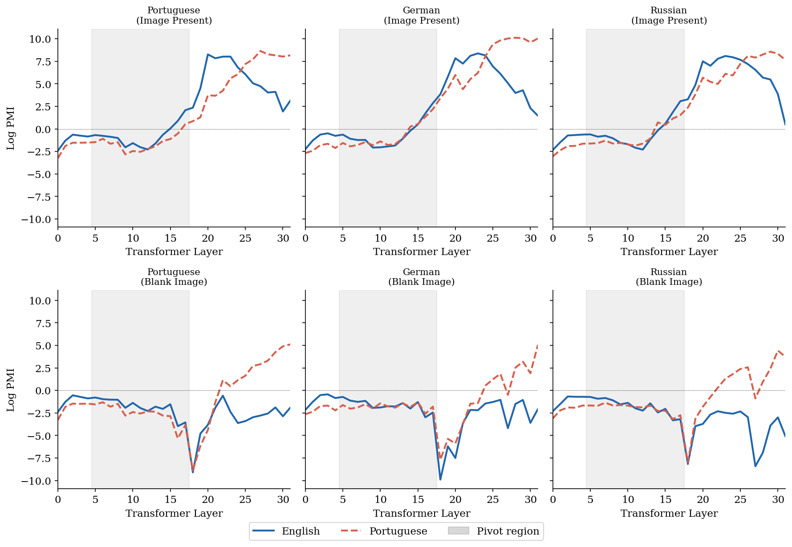
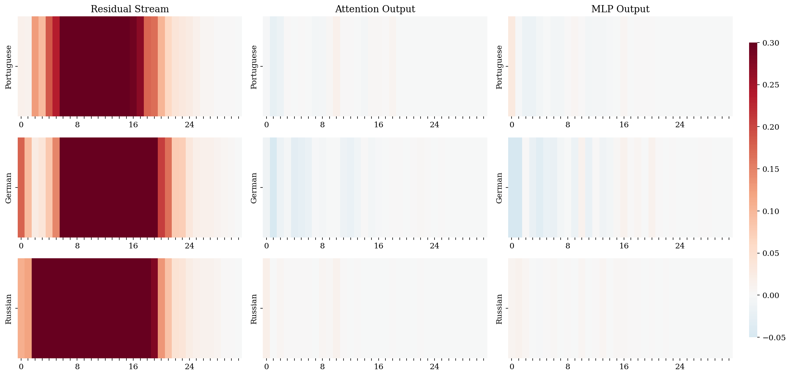
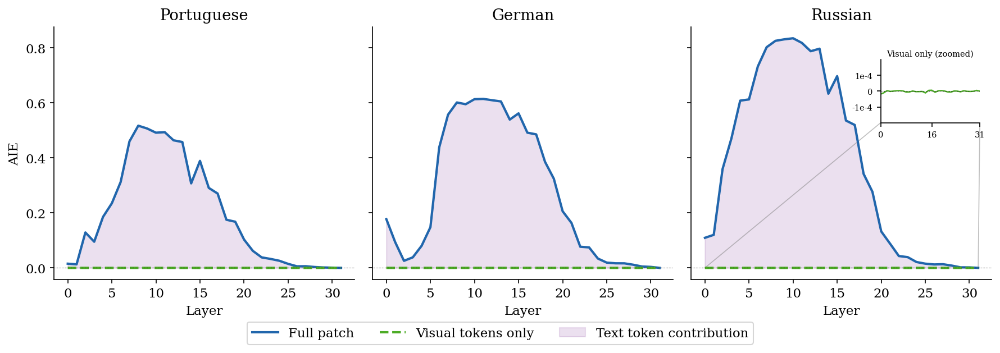
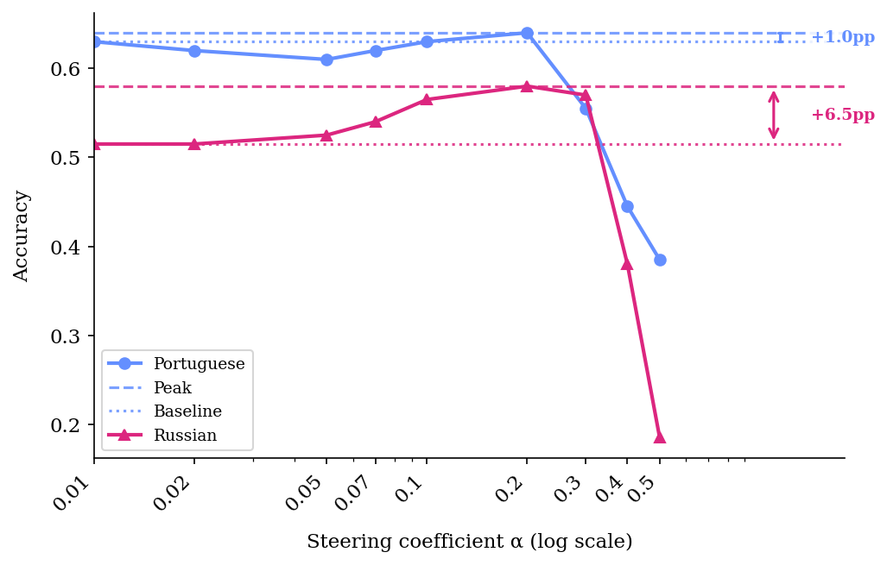
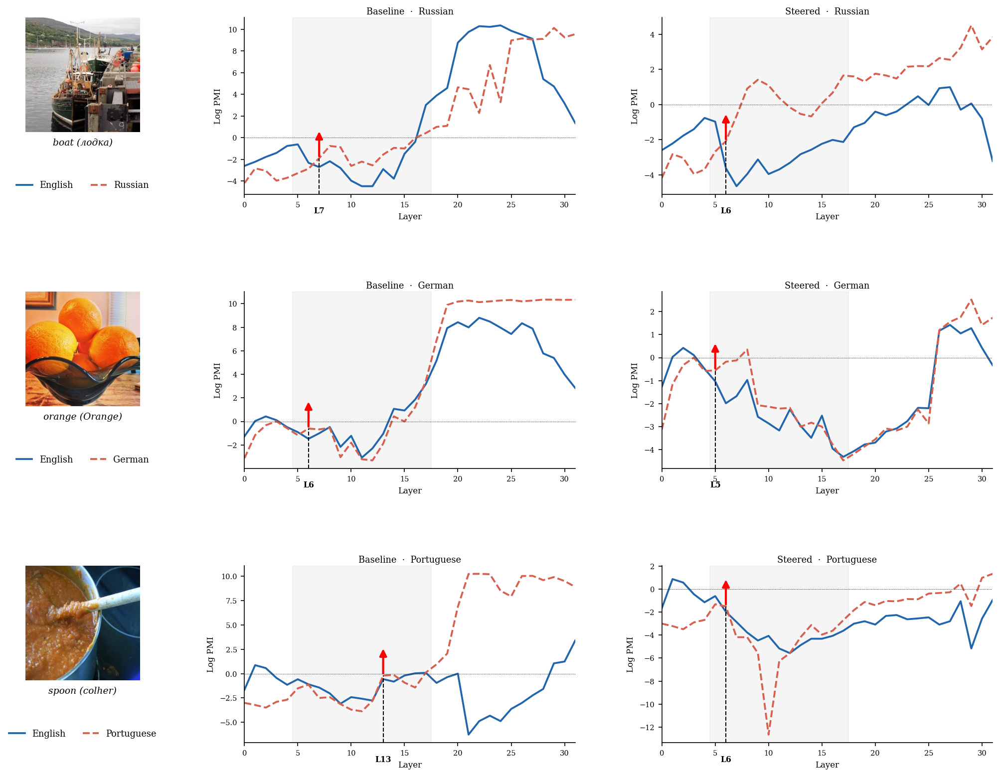
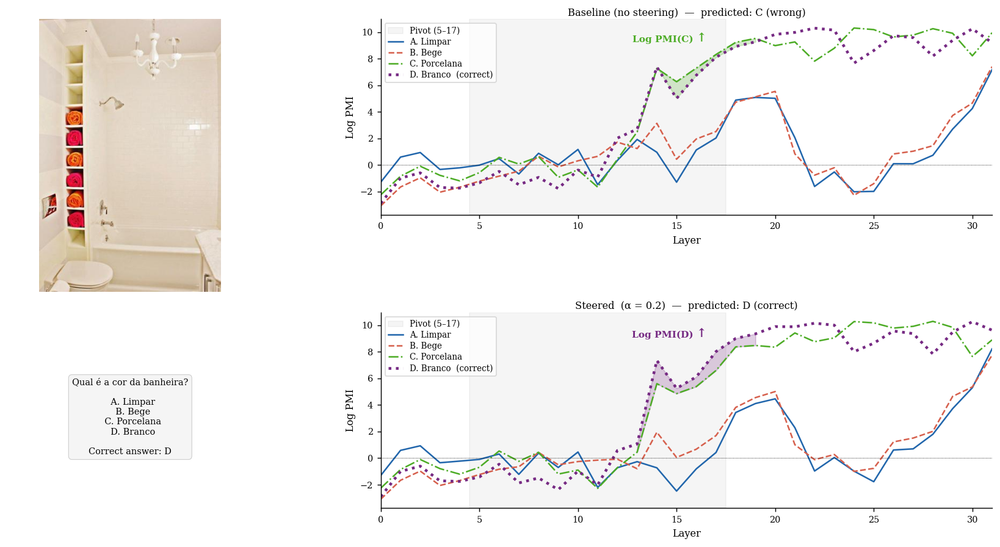

# Causal Localization of the English Pivot in LLaVA: Mechanistic VLM Analysis and Training-Free Multilingual Steering

**Abrar Zahin Raihan, Aurchi Chowdhury**

Bangladesh University of Engineering and Technology

Accepted to [MeLLM @ ACL 2026](https://mellm.org/) as an archival submission.

---

## Methodology

### Overview

This work presents a causal mechanistic analysis of why LLaVA-1.5-7B underperforms on non-English visual queries. We show that the model routes non-English inputs through an **English-biased representational bottleneck** (layers 5–17), inherited from its Vicuna backbone. Building on this finding, we derive training-free **language-steering vectors** at the identified pivot layers that improve non-English VQA without any fine-tuning.

### Step 1 — Logit-Lens Analysis (Exp 1)

We apply the logit lens to intermediate hidden states, reporting **Pointwise Mutual Information (PMI)**:

> PMI_ℓ[τ] = log p_ℓ[τ] − log p₀[τ]

This removes vocabulary-frequency bias and reveals where English vs. target-language token probabilities crystallise across the 32 layers. We compare a **real-image** condition against a **blank-image** condition to test whether the pivot is image-content-dependent.

**Finding:** English representations peak at layers 20–23, consistently *before* the target-language peak at layers 27–29. Without meaningful visual content, language-specific representations do not emerge at any layer.

### Step 2 — Causal Activation Patching (Exp 2)

We use causal tracing to measure the **Average Indirect Effect (AIE)** of patching each layer's hidden state from a non-English (clean) run with the corresponding state from an English (corrupted) run:

> AIE(ℓ) = E[ p_ℓ^patch[τ_en] − p^clean[τ_en] ]

We patch three component types independently: residual stream, attention output, and MLP output. We also isolate visual-token contributions.

**Finding:** Strongly positive AIE in layers 5–17 (peak at layer 8, AIE = 0.49 averaged across languages). Attention and MLP patches are near zero. Visual-token AIE is identically zero by construction. We define the **pivot region** as layers 5–17.

### Step 3 — Training-Free Steering (Exp 3)

For each non-English language ℓ, a steering vector is extracted at each pivot layer L ∈ {5, …, 17} as the mean difference between non-English and English hidden states on the probing set (N = 195 COCO examples):

> v_L^(ℓ) = (1/N) Σ [ h_L^(ℓ,i) − h_L^(en,i) ]

At inference, α·v_L^(ℓ) is added to the hidden state at each pivot layer via a forward hook (KV-cache compatible, no weight updates).

**Finding:** +6.5 pp on Russian MMMB (51.5% → 58.0%) and +4.0 pp on Portuguese (63.0% → 67.0%, surpassing the English baseline of 66.0%) at α = 0.2.

### Step 4 — Ablations (Exp 4)

Four ablations validate the approach:
- **Layer range ablation:** Mechanistic pivot region (5–17) outperforms fixed early/mid/late ranges.
- **Visual token ablation:** Blank images collapse baseline performance and make steering ineffective.
- **Steering coefficient sensitivity:** Performance peaks at α = 0.2 and degrades sharply beyond α = 0.3.
- **Cross-lingual transfer:** The German steering vector transfers perfectly to both Portuguese and Russian, suggesting a shared "non-English" axis.

---

## Figures

### Figure 1 — Logit-Lens PMI across layers

Blue (solid): English answer token; red (dashed): target-language token. Top row: real image; bottom row: blank image. Grey band marks the mechanistically identified pivot region (layers 5–17). With a real image, English PMI peaks first (layers 20–23) before the target-language peak (layers 27–29). Without visual content, language-specific representations do not emerge.

---

### Figure 2 — Average Indirect Effect (AIE) Heatmap

Rows: Portuguese, German, Russian. Columns: residual stream / attention output / MLP output. The residual-stream pivot (layers 5–17) is pronounced across all languages; attention and MLP patches carry negligible signal. Yellow dashed box: shared pivot region used for steering. Green dashed box: language-specific pivot regions highlighting per-language variation.

---

### Figure 3 — Design Validation: Visual-Token AIE

Visual-token-only AIE is identically zero because the same image is used in both the clean and corrupted runs — the 576 CLIP patch activations are identical by construction. This confirms that all measurable pivot signal runs through text-token positions.

---

### Figure 4 — Sensitivity to Steering Coefficient α

Accuracy on MMMB as a function of α for Portuguese and Russian. Performance peaks at α = 0.2 for both languages and degrades sharply beyond α = 0.3. Large α values corrupt generation quality (Russian drops to 0% at α = 0.5).

---

### Figure 5 — Qualitative Logit-Lens Walkthrough

Russian (top), German (middle), Portuguese (bottom) without steering (left) and with α = 0.2 (right). The red arrow marks the layer where target-language PMI first exceeds English. Steering shifts this crossover earlier, amplifying target-language representations at the pivot layers.

---

### Case Study — Representative Portuguese MMMB Example

A colour-attribute question where the baseline incorrectly peaks on option C at layer 31. After applying the Portuguese steering vector at pivot layers 5–17, option D (correct) dominates. The shaded fill in the pivot region highlights where C and D compete; steering resolves this in favour of the correct answer.

---

## Tables

### Table 1 — Main Results on MMMB (4-way multiple-choice accuracy, %)

*"Ours": best accuracy over α ∈ {0.01, 0.02, 0.05, 0.07, 0.1, 0.2, 0.3, 0.4, 0.5} (optimum α = 0.2 for PT and RU independently). EN: baseline only.*

| Method | EN | PT | RU |
|--------|----|----|-----|
| Baseline | 66.0 | 63.0 | 51.5 |
| Ours (α = 0.2) | 66.0 | **67.0** | **58.0** |
| Δ | — | +4.0 | +6.5 |

---

### Table 2 — Layer Range Ablation on MMMB (best α per cell, %)

| Layer range | PT | RU |
|-------------|----|----|
| Early (0–10) | 63.5 (α = 0.2) | 51.5 (α = 0.01) |
| Mid (11–21) | 63.0 (α = 0.01) | 54.5 (α = 0.1) |
| Late (22–31) | 63.0 (α = 0.01) | 51.5 (α = 0.01) |
| **Ours (5–17)** | **67.0** (α = 0.2) | **58.0** (α = 0.2) |

---

### Table 3 — Visual Token Ablation on MMMB (%)

*"Steer" = best α: α = 0.2 (real image), α = 0.02 (blank image).*

| Condition | PT Base | PT Steer | RU Base | RU Steer |
|-----------|---------|----------|---------|----------|
| Real image | 63.0 | 67.0 | 51.5 | 58.0 |
| Blank image | 42.0 | 41.5 | 46.5 | 48.5 |

---

### Table 4 — Cross-Lingual Transfer on MMMB (best α per cell, %)

| Vector source | MMMB-PT | MMMB-RU |
|---------------|---------|---------|
| PT (own) | — | 55.5 (α = 0.3) |
| DE | 67.0 (α = 0.2) | 58.0 (α = 0.2) |
| RU (own) | 63.5 (α = 0.3) | — |

---

## Running the Pipeline

| # | Script | Output |
|---|--------|--------|
| 1 | `data/build_probing_set.py` | `data/probing_set/` |
| 2 | `data/download_xgqa.py` | `data/xgqa/` |
| 3 | `data/download_mmmb.py` | `data/mmmb/` |
| 4 | `experiments/exp1_logit_lens.py` | `outputs/logit_lens/*.npy`, `exp1_metadata.json` |
| 5 | `experiments/exp2_activation_patching.py` | `outputs/patching/*.npy`, `outputs/pivot_layers.json` |
| 6 | `experiments/exp3_steering.py` | `outputs/steering_vectors/steering_vec_{pt,de,ru}.pt`, `outputs/eval_results/` |
| 7 | `experiments/exp4_ablations.py` | `outputs/ablations/{layer_range,visual_token,alpha_sensitivity,cross_lingual_transfer}.json` |
| 8 | `figures/plot_fig1_logit_lens.py` | `outputs/figures/fig1_logit_lens.pdf/png` |
| 9 | `figures/plot_fig2_patching_heatmap.py` | `outputs/figures/fig2_patching_heatmap.pdf/png` |
| 10 | `figures/plot_fig3_visual_contribution.py` | `outputs/figures/fig3_visual_contribution.pdf/png` |
| 11 | `figures/plot_fig4_alpha_curves.py` | `outputs/figures/fig4_alpha_curves.pdf/png` |
| 12 | `figures/plot_fig5_qualitative.py` | `outputs/figures/fig5_qualitative.pdf/png` |
| 13 | `tables/generate_tables.py` | `tables/tables.tex` |
